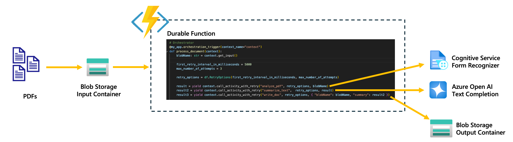

# Lab 2: Intelligent PDF Summarizer (Azure Durable Functions)

## 🧠 Overview

This lab implements an **Intelligent PDF Summarizer** using **Azure Durable Functions**. It mimics the behavior of a document processing pipeline that:

1. Watches for new PDF uploads in Azure Blob Storage.
2. Uses **mock OCR** and **mock AI summarization** to simulate Azure Form Recognizer and OpenAI Chat completion (due to quota limits).
3. Saves the generated summary in an output container.

---

## ⚙️ Workflow Architecture

### 🧭 Architecture Diagram




1. **Blob Trigger:**  
   Triggers the function when a new PDF is uploaded to the `input` container.

2. **Durable Orchestrator Function:**  
   Coordinates all steps:
   - `analyze_pdf`: Mocks OCR by reading blob content.
   - `summarize_text`: Mocks AI summarization.
   - `write_doc`: Saves the summary to the `output` container.

3. **Activity Functions:**  
   - `analyze_pdf`: Extracts mock text from PDF.
   - `summarize_text`: Generates a mock summary.
   - `write_doc`: Uploads summary to Blob Storage.

---

## 📁 Project Structure

```
.
├── function_app.py         # All orchestrator and activity functions defined here
├── local.settings.json     # Local configuration and secrets
├── host.json               # Azure Functions host settings
├── requirements.txt        # Python dependencies
├── .vscode/                # VS Code config (optional)
└── README.md               # This file
```

---

## 🛠️ Setup Instructions

### 1. Clone the Repository

```bash
git clone https://github.com/your-username/intelligent-pdf-summarizer.git
cd intelligent-pdf-summarizer
```

### 2. Create and Activate Virtual Environment

```bash
python3 -m venv .venv
source .venv/bin/activate
```

### 3. Install Dependencies

```bash
pip install -r requirements.txt
```

### 4. Configure Local Settings

Ensure `local.settings.json` includes:

```json
{
  "IsEncrypted": false,
  "Values": {
    "Storage": "UseDevelopmentStorage=true",
    "AzureWebJobsStorage": "<Your Azure Storage Connection String>",
    "BLOB_STORAGE_ENDPOINT": "<Same connection string again>",
    "COGNITIVE_SERVICES_ENDPOINT": "<Your Form Recognizer Endpoint (mocked)>",
    "COGNITIVE_SERVICES_KEY": "<Your Form Recognizer Key (mocked)>",
    "FUNCTIONS_WORKER_RUNTIME": "python",
    "AzureWebJobsFeatureFlags": "EnableWorkerIndexing"
  }
}
```
🔒 **Note:** These values are mocked, so they don’t need to be live services.

### 5. Run Locally

```bash
func start --verbose
```

---

## 🧪 Testing the App

- Upload a PDF file to the `input` container of your Azure Blob Storage.
- The function will trigger automatically, run the full workflow, and save a `.txt` summary to the `output` container.

---

## 🧪 Mock Function Examples

### `summarize_text`

```python
@my_app.activity_trigger(input_name='results')
def summarize_text(results):
    return {
        "content": "This is a mock summary of the PDF content."
    }
```

---

## 🔍 Explanation of Key Files

### 🔧 function_app.py

- Contains all function logic.
- Uses `azure.durable_functions.DFApp` for orchestrator/activity decorators.
- `blob_trigger()` kicks off orchestration when a new blob arrives.

### 🔧 local.settings.json

- Local secrets/config for running Azure Functions locally.
- Stores:
  - Storage connection strings
  - Form Recognizer credentials (not used due to mocking)
  - Runtime config for Durable Functions

---

## 🧰 Troubleshooting

| Problem                                 | Solution                                                      |
|------------------------------------------|---------------------------------------------------------------|
| Form Recognizer/OpenAI permission errors | Expected on student accounts. Mocking used to bypass.         |
| Blob connection errors                   | Check `BLOB_STORAGE_ENDPOINT` in `local.settings.json`. Must be a valid storage connection string. |
| Function not triggering                  | Ensure your PDF is uploaded to the correct input container.   |

---

## 📝 Notes

- This lab is designed to teach Durable Functions orchestration.
- Mocking lets you simulate real-world integrations while avoiding cost or quota issues.
- Replace mocks with actual API calls in real applications.

---


## ✅ Conclusion

This PDF summarizer showcases the power of Azure Durable Functions for serverless orchestration, even when using mock services. You now have a solid foundation to build real AI-based document workflows.

---
## Demo Video

[Watch the 5-minute demo on YouTube](https://www.youtube.com/watch?v=u6ZSNnYqSdc)

---
